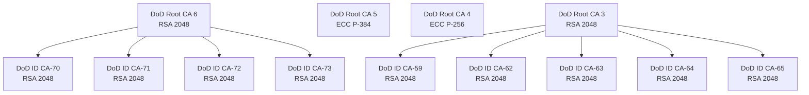

# Dolos - DoD PKI Testing Environment


Dolos provides a containerized environment for testing CAC authentication systems against a simulated DoD PKI infrastructure. It generates a complete certificate chain including root CAs, intermediate CAs, and client certificates that mimmics the actual DoD PKI structure for testing purposes.

Note: This is a work in progress and the key-sizes may not represent the actual DoD PKI key sizes.

## Current Components

### Root Certificate Authorities

- **DoDRoot6** - RSA 2048 w/ SHA384 (Expires: Jan 24 2053)
- **DoDRoot5** - ECDSA w/ SHA384 using secp384r1 (Expires: Jun 14 2041)
- **DoDRoot4** - ECDSA w/ SHA256 using prime256v1 (Expires: Jul 25 2032)
- **DoDRoot3** - RSA 2048 w/ SHA256 (Expires: Dec 30 2029)

### Intermediate CAs

#### Signed by DoDRoot3

- **DOD ID CA-59** (Expires: Apr 2 2025)
- **DOD ID CA-62** (Expires: Jun 1 2027)
- **DOD ID CA-63** (Expires: Apr 6 2027)
- **DOD ID CA-64** (Expires: Jun 1 2027)
- **DOD ID CA-65** (Expires: Jun 1 2027)

#### Signed by DoDRoot6

- **DOD ID CA-70** (Expires: May 16 2029)
- **DOD ID CA-71** (Expires: Dec 6 2028)
- **DOD ID CA-72** (Expires: May 16 2029)
- **DOD ID CA-73** (Expires: May 16 2029)

### PKI Heirarchy



### Services

- **OCSP Responder** - Running on port 2560, defaults to CA-59 but configurable
- **Certificate Generation** - Interactive client certificate creation with customizable parameters

## Directory Structure

The `create_ca.sh` script generates a comprehensive PKI structure under `/app`:

- Individual CA directories (CA-59 through CA-65)
- Root certificates in `/app/certs`
- CRLs in `/app/crl`
- Private keys in `/app/private`
- OCSP certificates and keys for each CA

## Usage

1. Start the container:

    ```bash
    docker run --rm -it \
      --mount type=bind,source=$(pwd)/root,target=/opt \
      --mount type=bind,source=$(pwd)/app,target=/app \
      --name ocsp -p 2560:2560 ocsp /bin/bash
    ```

2. Generate PKI infrastructure:

    ```bash
    /opt/create_ca.sh
    ```

3. Create client certificates:

    ```bash
    /opt/create_client.sh
    ```

## Planned Features

- LDAP/Active Directory integration for certificate authorization
- CRL Distribution Point (CRLDP) implementation
- Web interface for certificate management
- Automated testing tools for CAC authentication
- Support for additional DoD certificate profiles
- Docker Compose setup for multi-service deployment

## References

- CAC Next Generation Implementation Guide v2.6
- DoD PKI Transitional Implementation Guide
- Various DoD certificate specifications and standards
- <https://crl.gds.disa.mil/>

## Notes

The OCSP responder (docker-entrypoint.sh) can be configured for any CA by modifying the CA variable. Default configuration watches CA-59's index.txt for changes and provides real-time certificate status responses. Currently the Dockerfile has this option commented out.

## Screenshots

Creating the CAs:


Name:


EDIPI:


Org Category:


Agency Code:


Person/Org Category:


Cert Lifetime:


Selecting the Signing CA:


Certificate Generated:

